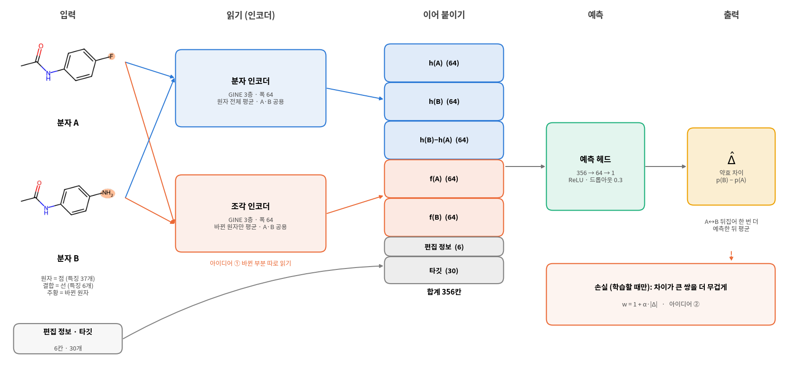

# 쌍 기반 활성 차이 예측 (`ac_pipeline.ipynb`)

구조가 비슷한 두 분자 A, B를 한 번에 넣어 **활성 차이 Δ = p(B) − p(A)** 를 예측한다.
특히 구조는 거의 같은데 활성이 크게 다른 쌍(**activity cliff**, |Δ| ≥ 1 = 10배 이상 차이)을 잘 맞히는 것이 목표다.

## 1. 데이터와 쌍

- **데이터:** MoleculeACE 30개 타깃 (Ki 23개, EC50 7개), 분자 48,714개 (서로 다른 분자 35,633개)
- **분자 나누기:** 학습 64% · 검증 16% · 평가 20% (MoleculeACE 분할 + 학습 분자의 20%를 검증으로)
- **쌍 만들기:** 같은 타깃 안에서 지문 유사도(ECFP4 Tanimoto)가 0.5 이상인 두 분자를 쌍으로 만든다. 쌍은 두 종류로 쓴다
  - **한 군데만 다른 쌍:** 공통 구조(MCS)를 뺀 바뀐 부분이 한 덩어리이고 10원자 이하인 쌍
  - **유사 쌍 전부:** 유사도 조건만 만족하면 전부 (여러 군데 바뀐 쌍 포함, 약 5배 많음)
- **평가 원칙:** 모든 쌍에 **실측값을 아는 학습 분자가 하나 이상** 들어가게 한다.
  두 분자 모두 처음 보는 쌍을 Δ만으로 평가하면, 두 분자의 활성을 똑같이 틀려도(실제 3, 0을 13, 10으로) 정답 처리되기 때문이다

## 2. 모델



- 두 분자를 **두 번 읽는다** — 분자 전체(분자 인코더)와 바뀐 부분만(조각 인코더)
- 읽은 결과에 편집 정보(무엇이 몇 군데 바뀌었는지)와 타깃을 붙여 Δ를 바로 예측한다
- 인코더는 두 가지를 비교한다
  - **GINE:** 그래프 신경망(3층, 폭 64), 처음부터 학습
  - **Mole-BERT:** 200만 분자로 미리 학습된 그래프 신경망(5층, 폭 300)을 가져와 미세조정
- **비교 대상:** 항상 0으로 답하기 / SVR(분자 지문 + 서포트 벡터 회귀, 분자별 예측 후 빼기) /
  같은 인코더로 분자별 예측 후 빼기(쌍 입력이 정말 도움이 되는지 보기 위해)
- 같은 설정을 시드 3개로 학습하고, 세 모델의 예측을 평균한 **시드 앙상블**도 함께 본다

## 3. 지금까지 결과

평가 쌍 오차(RMSE, 낮을수록 좋음). bal = (cliff + non-cliff) / 2

| | 한 군데만 다른 쌍<br>cliff / non-cliff / bal | 유사 쌍 전부<br>cliff / non-cliff / bal |
|---|---|---|
| 항상 0 | 1.720 / 0.465 / 1.092 | 1.796 / 0.490 / 1.143 |
| **SVR** | **0.928 / 0.447 / 0.688** | 0.872 / **0.459** / **0.665** |
| GINE 분자별 | 1.379 / 0.563 / 0.971 | 1.338 / 0.589 / 0.964 |
| Mole-BERT 분자별 | 1.219 / 0.568 / 0.894 | 1.160 / 0.582 / 0.871 |
| GINE 쌍 (앙상블) | 1.119 / 0.460 / 0.790 | 0.986 / 0.472 / 0.729 |
| **Mole-BERT 쌍 (앙상블)** | 1.049 / 0.472 / 0.761 | **0.839** / 0.491 / **0.665** |

- **쌍으로 넣는 것이 분자별 예측보다 낫다.** 같은 인코더로 비교하면 모든 칸에서 쌍 모델이 이긴다
- **사전학습 인코더(Mole-BERT)가 가장 큰 개선이다.** 유사 쌍 전부에서는 cliff가 SVR보다 낮고, bal은 SVR과 같다.
  한 군데만 다른 쌍에서는 아직 SVR에 진다
- **non-cliff(차이가 작은 쌍)는 아직 SVR이 가장 낫다**
- **Δ만 맞히는 것은 아니다.** 학습 분자의 실측값에 Δ̂를 더해 평가 분자의 활성을 추정해도 분자별 GNN보다 잘 맞힌다(다만 SVR보다는 못하다)
- **주의:** 30개 타깃을 모델 하나로 학습해서, 평가 분자의 1/3은 다른 타깃의 학습 데이터로 이미 본 분자다.
  처음 보는 분자만 보면 Mole-BERT와 SVR은 cliff에서 거의 같다 (이 문제는 팀에서 논의 중)

## 4. 지금 하고 있는 일 (`develop.md`)

목표는 **"차이가 작은 쌍도, 큰 쌍(cliff)도 잘 맞히는 모델"** 이다. 순서대로 진행하고 항목마다 결과를 확인한다.

| 순서 | 내용 | 상태 |
|---|---|---|
| ■0 | 모델을 고르는 기준을 bal로 바꾸기 (전체 오차는 차이가 작은 쌍에 치우쳐 있어서) | 완료 |
| ■1 | 쌍 판정 고치기: 여러 군데 바뀐 쌍도 바뀐 부분 정보를 살리고, 편집 정보를 "무엇이 몇 군데 바뀌었는지"로 자세히 | **진행 중** — 쌍 다시 만들고 전/후 비교 학습 중 |
| ■2 | 바뀐 부분을 따로 읽는 것(조각 인코더)이 실제로 도움이 되는지 빼고 재보기 | 대기 |
| ■3 | 학습 쌍과 평가 쌍 종류를 따로 정해 비교하기 (유사 쌍으로 학습 → 한 군데만 다른 쌍으로 평가) | 대기 |
| ■4 | 차이가 큰 쌍에 가중치를 주는 손실(α)이 정말 쓸모 있는지 정리, 다른 가중 방식 비교 | 대기 |
| ■5 | **먼저 cliff인지 판단하고, 아닐 것 같으면 예측을 줄이는 구조** (차이가 작은 쌍의 오차 줄이기) | 대기 |
| ■6 | 학습을 멈추는 기준도 bal로 통일 | 대기 |
| ■7 | 설명 글을 결과에 맞게 고치기 | 대기 |

## 5. 노트북 구성

| 섹션 | 내용 |
|---|---|
| 1–2 | 데이터 받기, 분자 나누기 |
| 3–4 | 쌍 판정과 쌍 만들기 (4-1: 유사 쌍 전부) |
| 5–6 | 쌍 통계와 예시 |
| 7 | 비교 대상 SVR |
| 8–9 | 그래프 변환, GINE 쌍 모델 학습, 분자별 비교군 |
| 10 | Mole-BERT 쌍 모델 학습, Mole-BERT 분자별 비교군 |
| 11 | 결과 비교 (모든 비교군을 같은 표·그림에), 기준 분자 평가, 누수 점검 |
| 12 | 결과 정리 |

## 6. 실행

```bash
CUDA_VISIBLE_DEVICES=0 jupyter nbconvert --to notebook --execute --inplace \
    --ExecutePreprocessor.timeout=-1 ac_pipeline.ipynb
```
- 환경: `aienv` (rdkit, torch, torch_geometric, scikit-learn)
- `data/`와 `runs/`는 올리지 않는다. 쌍 목록, 학습된 가중치, 예측값을 여기에 저장해 두고, 있으면 다시 계산하지 않는다
- 처음부터 실행하면 수십 시간, 가중치와 예측값이 있으면 수 분
- Mole-BERT 가중치는 `runs/pretrained/Mole-BERT.pth`에 둔다 ([github.com/junxia97/Mole-BERT](https://github.com/junxia97/Mole-BERT))
